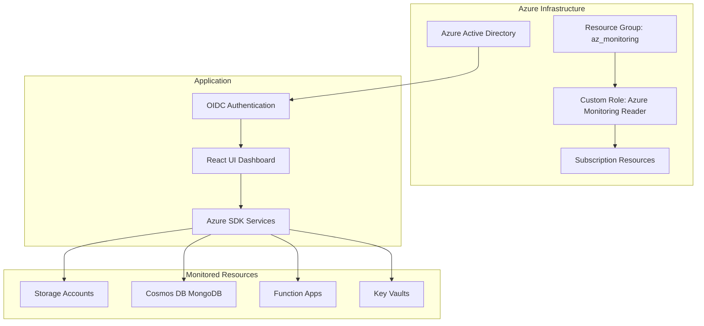

# Azure Admin - Infrastructure Monitoring UI

A comprehensive monitoring dashboard for Azure infrastructure, providing secure read-only access to Azure resources including Storage Accounts, Cosmos DB, Function Apps, and Key Vaults.

## 🏗️ Architecture

This is a **monorepo** containing:

- **`packages/az-setup`**: Azure infrastructure setup scripts
- **`packages/ui`**: React-based monitoring dashboard



## 🚀 Quick Start

### Prerequisites

- **Node.js 18+**
- **Azure CLI** or **Azure PowerShell**
- **Azure subscription** with appropriate permissions
- **Azure AD application** for OIDC authentication

### 1. Setup Azure Infrastructure

Choose your preferred method:

#### Option A: Azure CLI (Node.js)
```bash
cd packages/az-setup
npm run setup
```

#### Option B: PowerShell
```powershell
cd packages/az-setup
./Setup-Monitoring.ps1
```

### 2. Configure and Run UI

```bash
# Install dependencies
npm install

# Configure environment
cd packages/ui
cp .env.example .env
# Edit .env with your Azure application details

# Start development server
npm run dev
```

## 🔐 Security & Access Control

### Required Azure AD Setup

1. **Azure AD Application Registration**
   - Redirect URIs configured for your domains
   - Required API permissions:
     - Microsoft Graph: `User.Read`
     - Azure Service Management: `user_impersonation`
     - Storage: `user_impersonation`
     - Key Vault: `user_impersonation`

2. **Azure AD Group**: `az_monitoring`
   - Users must be members to access the application
   - Group gets assigned the custom monitoring role

3. **Custom Role**: `Azure Monitoring Reader`
   - Read-only access to all monitored resources
   - No write/delete permissions
   - Specifically scoped for monitoring operations

### Permissions Granted

The application provides **read-only** access to:

| Service | Permissions |
|---------|-------------|
| **Storage Accounts** | ✅ List/read blobs<br/>✅ Preview queue messages<br/>❌ No write/delete |
| **Cosmos DB** | ✅ MongoDB find/aggregate queries<br/>❌ No insert/update/delete |
| **Function Apps** | ✅ Read app settings<br/>✅ View function status<br/>❌ No configuration changes |
| **Key Vault** | ✅ List certificates & expiration<br/>✅ Read secret names & values<br/>❌ No create/update/delete |

## 🎯 Features

### 📊 Dashboard
- Overview of all Azure resources
- Health status monitoring
- Certificate expiration alerts
- Function app status tracking

### 🗄️ Storage Monitoring
- **Blob Explorer**: Navigate containers and view file contents (including PDFs/images)
- **Queue Monitor**: View message counts and preview queue contents
- **Search & Filter**: By name, tags (environment, application)

### 🗃️ Cosmos DB Shell
- **MongoDB Operations**: Execute find and aggregate queries
- **Read-only**: Insert/update/delete operations blocked
- **Multi-database**: Access all databases and collections

### ⚡ Function Apps
- **App Settings**: View configuration (secrets masked appropriately)
- **Function Status**: Monitor individual function health
- **Search & Filter**: Find functions by name or app

### 🔐 Key Vault Monitor
- **Certificate Tracking**: View expiration dates, sorted by urgency
- **Secret Management**: List and view secret values
- **Security**: Audit trail for access

### 👤 User Management
- **Personal Preferences**: Saved to secure Azure blob storage
- **Quick Access**: Bookmark frequently used resources
- **Subscription Switching**: Multi-tenant support

## 🛠️ Technology Stack

### Frontend
- **React 18** with TypeScript (strict mode)
- **Ant Design** + **Tailwind CSS** for UI
- **React Router** for navigation
- **Zustand** for state management
- **React Query** for data fetching
- **React OIDC Context** for authentication

### Backend/Services
- **Azure SDK** for JavaScript/TypeScript
- **Microsoft Graph API** for user management
- **Azure Resource Manager API** for resource access

### Development
- **Turborepo** for monorepo management
- **Vite** for development and building
- **Vitest** for testing
- **ESLint** for code quality
- **Storybook** for component documentation

### Deployment
- **Azure Static Web Apps** for hosting
- **Azure Pipelines** for CI/CD

## 📁 Project Structure

```
azure-admin/
├── packages/
│   ├── az-setup/              # Azure infrastructure setup
│   │   ├── setup-monitoring.js    # Node.js setup script
│   │   ├── Setup-Monitoring.ps1   # PowerShell setup script
│   │   └── README.md
│   └── ui/                    # React application
│       ├── src/
│       │   ├── components/    # Atomic design components
│       │   │   ├── atoms/     # Basic UI elements
│       │   │   ├── molecules/ # Composed components
│       │   │   └── organisms/ # Complex components
│       │   ├── services/      # Azure SDK integrations
│       │   ├── stores/        # Zustand state management
│       │   ├── types/         # TypeScript definitions
│       │   └── utils/         # Utility functions
│       └── README.md
├── .azure-pipelines/          # CI/CD configuration
├── turbo.json                 # Turborepo configuration
└── package.json               # Root workspace configuration
```

## 🚦 Development Workflow

### Available Scripts

```bash
# Development
npm run dev          # Start development server
npm run build        # Build for production
npm run test         # Run tests
npm run lint         # Code quality checks

# Azure Setup
cd packages/az-setup
npm run setup        # Run Azure infrastructure setup
```

### Environment Configuration

Create `packages/ui/.env` from `.env.example`:

```bash
VITE_AZURE_CLIENT_ID=your-azure-client-id
VITE_AZURE_TENANT_ID=your-azure-tenant-id
```

## 🌐 Deployment

### Azure Static Web Apps

The application is designed for deployment to Azure Static Web Apps with the included Azure Pipeline.

1. **Create Azure Static Web App**
2. **Configure Azure Pipeline**
3. **Set up variable groups** with required secrets
4. **Deploy via Git workflow**

### Manual Deployment

```bash
# Build the application
npm run build

# Deploy to Azure Static Web Apps
az staticwebapp create \
  --name azure-admin-ui \
  --resource-group az_monitoring \
  --source packages/ui/dist \
  --location "East US"
```

## 🤝 Contributing

1. **Fork the repository**
2. **Create a feature branch**
3. **Follow atomic design principles** for components
4. **Ensure type safety** with TypeScript
5. **Add tests** for new functionality
6. **Update documentation** as needed

## 📋 Prerequisites for Production

### Azure Resources Required
- Azure subscription with Owner/Contributor role
- Azure AD application registration
- Azure Static Web Apps resource (for deployment)

### Azure AD Permissions Required
- **User Access Administrator** (to create custom roles)
- **Global Administrator** (to create Azure AD groups)

## 🆘 Troubleshooting

### Common Issues

1. **Authentication failures**
   - Verify Azure AD app registration
   - Check redirect URIs
   - Ensure API permissions are granted

2. **Access denied errors**
   - Confirm user is member of `az_monitoring` group
   - Verify custom role assignment
   - Check subscription-level permissions

3. **Build failures**
   - Ensure Node.js 18+ is installed
   - Clear node_modules and reinstall
   - Check environment variables

### Support

For issues and questions:
1. Check the [troubleshooting guide](packages/az-setup/README.md#troubleshooting)
2. Review Azure portal for resource configuration
3. Verify user permissions and group membership

## 📄 License

This project is licensed under the MIT License - see the LICENSE file for details.

---

**🔒 Security Note**: This application provides read-only monitoring access to Azure resources. All operations are logged and audited through Azure Activity Log.